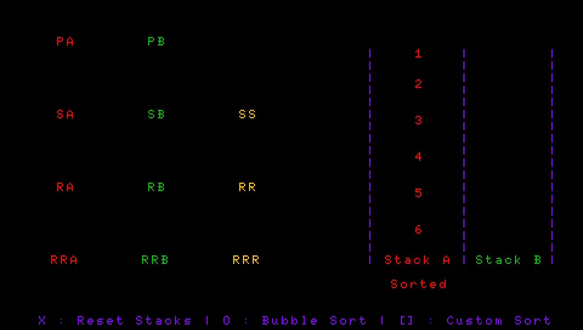

# Push Swap Tester for PSVita

Useless project made to train myself with Vita Dev Suite and push_swap project for 42 school

# What it can do

The name "tester" is kinda wrong, but I don't care.

This is not a tester, it's more like a trainer or a visualizer

Every push_swap actions are implemented and can be used with front touchpad.

You can also use X to reset stack, O to use bubble sort, [] to use a really simple custom sort, and SELECT to leave the app

# How to use

- Have an hacked Vita
- Install the vpk
- Create the folder "push_swap" in ux0://data/
- Create a file "numbers.txt" inside that folder
- Put one number per lines inside this text file 
- Keep in mind that it's working with more than 6 numbers, but will only output the first 6 numbers that are on the stack

# What you can do with this

If you have [VDS](https://github.com/Vita-Development-Suite) installed, you can change the code and recompile it.

The printf functions are based on a custom "framework" (header...) that I made to ease my dev process with VDS.

It can be found inside the folder "framework" of this repo. Just put it inside the "includes" folder of your VDS installation

Or you can still replace my functions with yours, might be irritating.

You also might be able to port this project to VitaSDK and use their printf helper

# Fixes 🩹
- The app seems to crash after some stacks resets. Might be a malloc/free issue
- The counter doesn't clear nicely with resetting the stack. An ok-tier way to clear it is used now (but not perfect for me).
- Seems like the counter is buggy when executing 2 times a sorting method (Seems like it goes to 0 without any reason)
